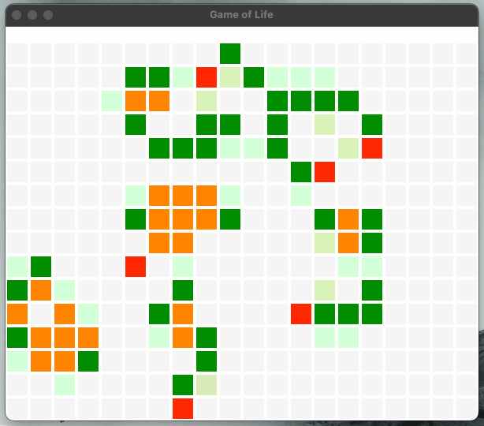

# Game of life

This is a sample implementation of the game of life in go using `faiface/pixel` 2D game library (https://github.com/faiface/pixel).



Features:
- Graphical User Interface with different colors representing the cell state and condition
  - : Dead - the conditions don't allow a reproduction of a new cell in the next state
  - : Dead - a new cell will be reproduced in the next state
  - : Live Cell - not in danger
  - : Live Cell - Overpopulated - will die in the next state
  - : Live Cell - Underpopulated - will die in the next state
- Customizable width, height, cell size, and framerate (see Usage)
- A new random board is populated at every run

# Running the game

To run the game run `make run` in the root directory of the repo.

## Usage
```
  -cellSize int
    	The pixel size of each cell (default 30)
  -frameRate duration
    	The framerate in milliseconds (default 500ms)
  -height float
    	The pixel size of the height of the grid (default 300)
  -width float
    	The pixel size of the width of the grid (default 600)
```
